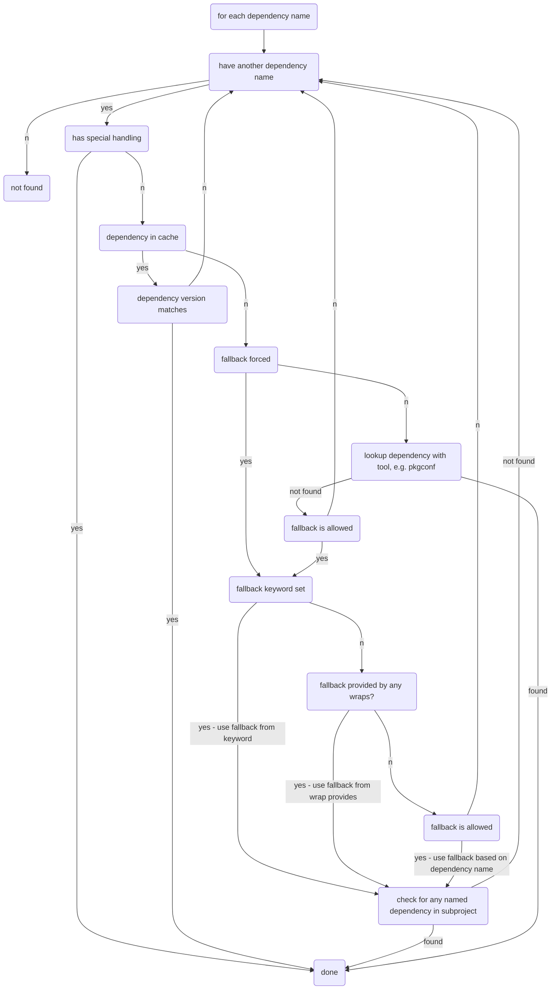

```mermaid
flowchart TD
  start(for each dependency name)
  start --> loop

  loop(have another dependency name)
  loop --yes--> special
  loop --no--> notfound

  special(has special handling)
  special --yes--> found
  special --no--> cache

  cache(dependency in cache)
  cache --yes--> vercheck
  cache --no--> forcefallback

  vercheck(dependency version matches)
  vercheck --yes--> found
  vercheck --no--> loop

  forcefallback(fallback forced)
  forcefallback --yes--> fallback
  forcefallback --no--> lookup

  fallback(fallback keyword set)
  fallback --yes - use fallback from keyword--> handlefallback
  fallback --no--> fallbackimplicit

  fallbackimplicit(fallback provided by any wraps?)
  fallbackimplicit --yes - use fallback from wrap provides--> handlefallback
  fallbackimplicit --no--> fallbackimplicitname

  fallbackimplicitname(fallback is allowed)
  fallbackimplicitname --yes - use fallback based on dependency name--> handlefallback
  fallbackimplicitname --no--> loop

  handlefallback(check for any named dependency in subproject)
  handlefallback --found--> found
  handlefallback --not found--> loop

  lookup(lookup dependency with tool, e.g. pkgconf)
  lookup --found--> found
  lookup --not found--> fallbackafterlookup

  fallbackafterlookup(fallback is allowed)
  fallbackafterlookup --yes--> fallback
  fallbackafterlookup --no--> loop

  found(done)
  notfound(not found)
```

fallback allowed: allow\_fallback is set to true or requirement is required

